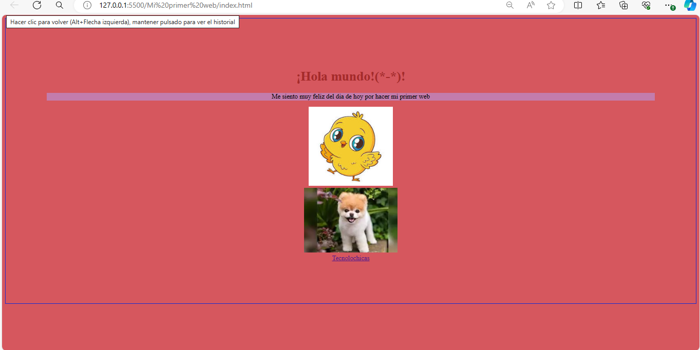

# Mi primera pagina web

El primer proyecto web creado con HTML durante el bootcamp de TECNOLOCHICAS-PRO, donde se practica el uso de etiquetas fundamentales, así como la incorporación de recursos externos como imágenes y enlaces de navegación tanto internos como externos al sitio.

[proyecto en linea ](https://primerwebprincipiante.netlify.app/)

- Tecnologías
 
* HTML
* CSS

- Capturas de pantalla 

- Créditos
Creado por Itzel Nicolás en el bootcamp de Technolochicas PRO.
